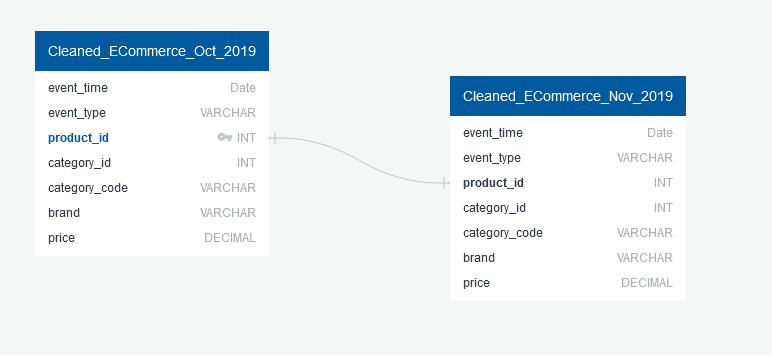

# Project Overview
E-commerce is a rapidly growing corner of the global consumer market. As more customers find it is easier to shop on their phones and computers, big box retailers are struggling to match the demand of their rapidly growing online counterparts. The behavior of an online consumer is different than that of an in-person shopper. The user is no longer restricted to the pervasive nature of a physical shopping cart. Instead, an online shopper has ability to shop at their own pace with the ability to add and remove items from their cart in an instant without the concern of any physical or social aspects of in-person shopping. The analysis of this project is centered around this change in the behaviors of the consumer. Our team will accurately advise market brands using the data we collected and visualize how these products compete with others on the digital market and what products consumers want in their carts.

### Description of data source:

The source dataset comes from Kaggle.com from a large multi-category online store, collected by Open CDP project, and includes two CSV files with over 95 million values between the two files.  The features of the two tables are: 

- event_time – Stored as UTC datestamp
- event_type - Event type: one of [view, cart, remove_from_cart, purchase]
- product_id – Unique product ID
- category_id – Unique category ID
- category_code – Description of a product and category
- brand – Brand name of product
- price – In USD ($)?
- user_id – Permanent user ID
- user_session – session based on user ID

The focus of our analysis will be around event_type, product_id, category_code, and brand.

If brand X were to sell product Y what would be the expected price?
What users buy the most products? What product(s)?

## ERD

## Machine Learning Model

_The team working on this repository are communicating through SLACK_

